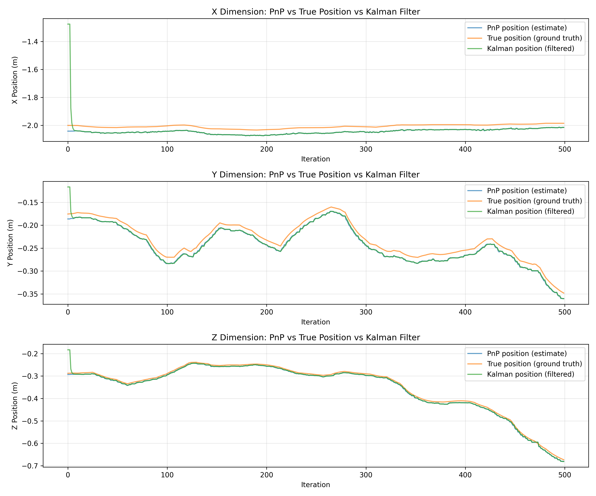
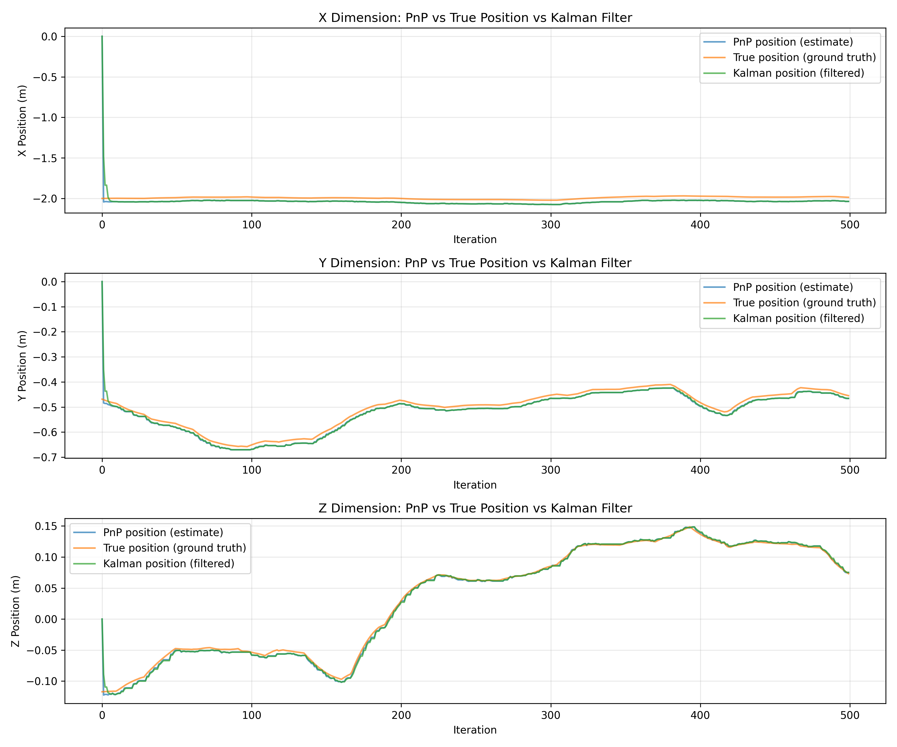
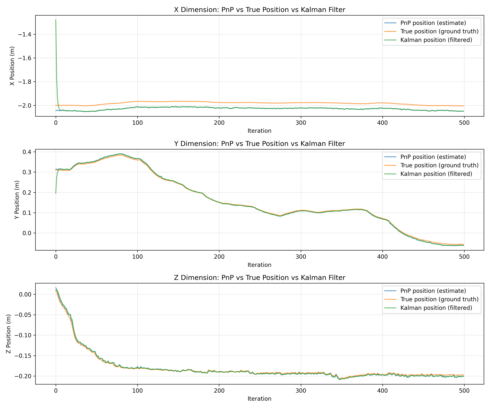
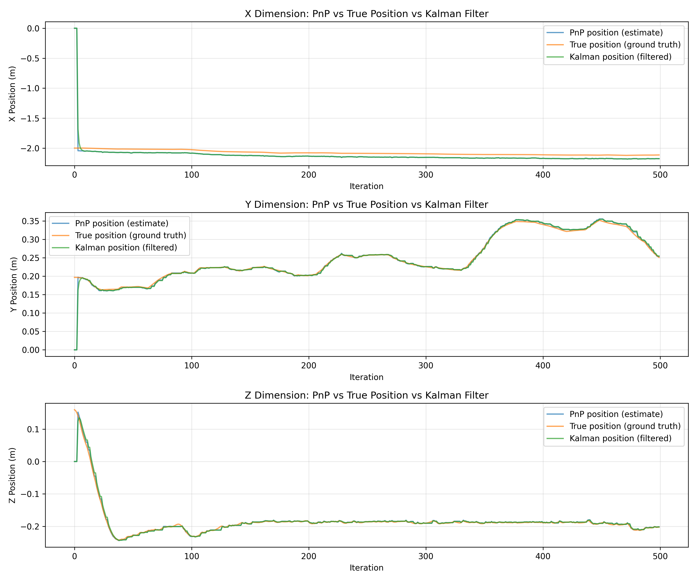

## Kalman Filter Design for Drone State Estimation

### Position Estimation
A 9-dimensional Kalman filter was implemented to estimate drone position, incorporating position, velocity, and acceleration components in three dimensions (x, y, z). This configuration was selected to leverage accelerometer measurements from the drone for improved state estimation accuracy. The implementation was based on the framework established in previous coursework (Lab 9).

### Orientation Estimation
A 6-dimensional Kalman filter was utilized for orientation estimation, tracking roll, pitch, yaw angles and their corresponding angular velocities. The gyroscope sensor provides angular velocity measurements directly; therefore, no acceleration terms were included in this filter, as the gyroscope does not provide angular acceleration information.

### Noise Covariance Tuning
Both process and measurement noise variances were tuned experimentally to achieve a balance between estimation smoothness and accuracy. Smoothness was particularly important due to the derivative term in the PID controllers used for drone control. Despite optimization efforts, the state estimates exhibited some discontinuities, which could potentially be further reduced through additional tuning refinement.

## Experimental Results

Kalman filter performance was evaluated in two distinct operational modes: passive hover with constant thrust and active hover with PID control on the thrust component. For both configurations, initial states were set to zero, as gate positions were not known a priori. While first visual measurements could have been used to initialize the filters, this approach was not implemented to maintain simplicity.

*Figure 1: Kalman filter state estimates during passive hover mode with constant thrust.*

*Figure 2: Kalman filter state estimates during passive hover mode with constant thrust (rotated gates).*

*Figure 3: Kalman filter state estimates during active hover mode with PID controller on thrust.*

*Figure 4: Kalman filter state estimates during active hover mode with PID controller on thrust (rotated gates).*

### Analysis of Results
No significant differences were observed between passive and active hover modes in terms of Kalman filter estimation quality. The drone's vertical position adjustment via PID control did not introduce detectable noise or drift into the state estimates. The filters successfully tracked gate positions with comparable accuracy across both operational scenarios.

## Challenges and Implementation Decisions

### Control Architecture Limitations
The initial approach employed two independent Kalman filters—one for position and one for orientation—to process accelerometer and gyroscope measurements alongside visual gate detection data. These estimates were intended to inform PID controllers with the same configuration as the previous assignment. However, this architecture proved insufficient to cross the first gate; while the drone approached the target, the loss of visual markers caused the filter estimates to diverge based solely on inertial measurements, resulting in controller instability.

### Successful Configuration
A functional solution was achieved through active hover control with PID stabilization of the thrust component, which enabled the drone to maintain stable positioning at the gate's vertical center. Initial experiments with roll and pitch PID controllers showed inconsistent performance; the drone occasionally crossed the first gate but frequently experienced uncontrolled oscillations and flips. Consequently, roll and pitch control was disabled in the final submission, though the corresponding code remains available. The orientation Kalman filter was similarly retained for completeness despite becoming functionally obsolete.

### Technical Issues
During implementation, the `cv2.solvePnP` function with the `SOLVEPNP_IPPE_SQUARE` flag failed to produce reliable results. Switching to the `SOLVEPNP_ITERATIVE` flag resolved the issue, though the reason for this behavior remains unclear, as `SOLVEPNP_IPPE_SQUARE` is theoretically more appropriate for planar objects.